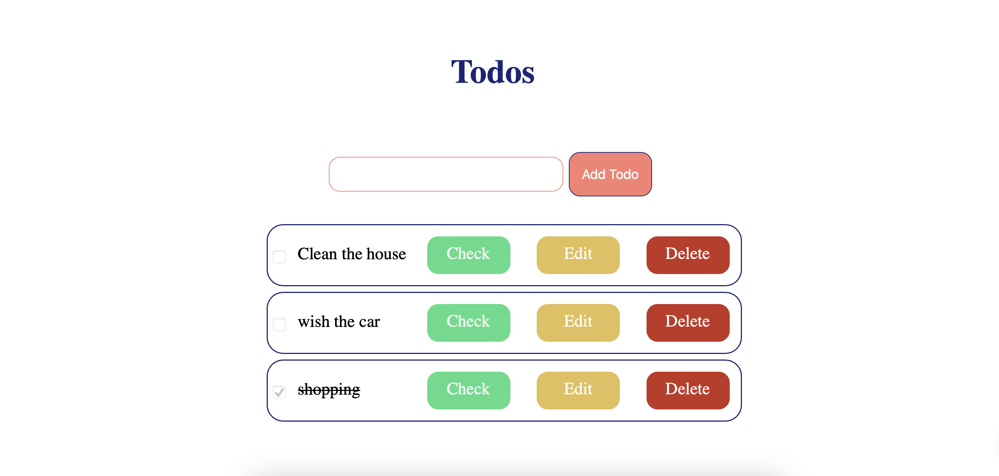
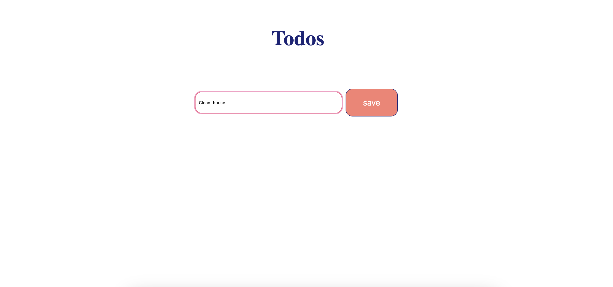

# ToDo App
Simple todo app using flask-python



## Installation
clone the project
```
git clone https://github.com/mays4/todo-flask-python.git
```
install python3 virtual enviorment 
```
python3 -m venv env
source env/bin/activate
```
run the project
```
flask run 

```


#### Build with Flask-Python, HTML
#### styled with CSS